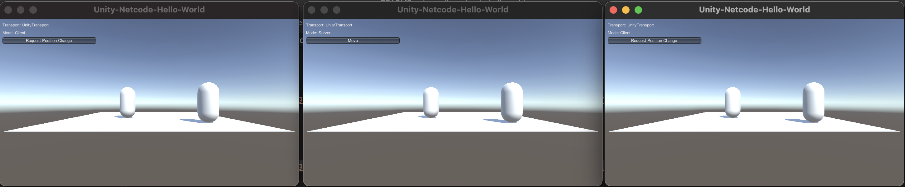

# Netcode "Hello World" Project

[](https://github.com/humbertodias/unity-netcode-helloworld/actions/workflows/main.yml)


### Tested on

* Mac OS Monterey
* Unity 2021.3.10f1

### How to run

Server

```sh
bash -c "$(curl -fsSL https://raw.githubusercontent.com/humbertodias/unity-netcode-helloworld/main/server.sh)" &
```

Client

```sh
bash -c "$(curl -fsSL https://raw.githubusercontent.com/humbertodias/unity-netcode-helloworld/main/client.sh)" &
bash -c "$(curl -fsSL https://raw.githubusercontent.com/humbertodias/unity-netcode-helloworld/main/client.sh)" &
```

## Server +2 clients



### Ref

* [NetCode HelloWorld Tutorial](https://docs-multiplayer.unity3d.com/netcode/current/tutorials/helloworld)
* [Unity CommandLineArguments](https://docs.unity.cn/530/Documentation/Manual/CommandLineArguments.html)
* [Unit GHA](https://isaacbroyles.com/gamedev/2020/07/04/unity-github-actions.html)
* [Docker unityci](https://hub.docker.com/r/unityci/editor/tags)
* [Unity platforms](https://docs.unity3d.com/ScriptReference/BuildTarget.html)